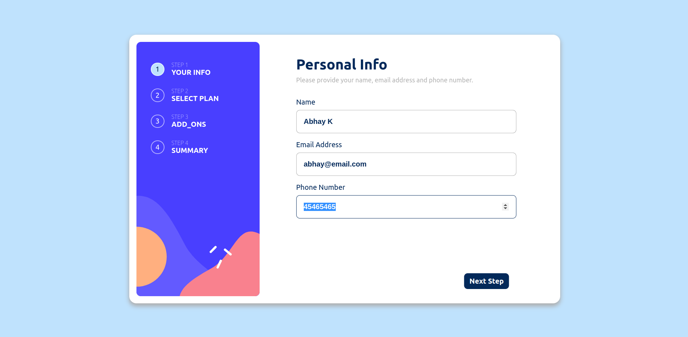

# Rock Paper Scissors Game (Frontend Mentor Challenge)

## [visit website here](https://abhay8696.github.io/multi-step-form/)

## About Website

A simple multi-step form, where information is stored using react-useState hook. App remembers and transfers data filled in form to next steps.

A visiting users are be able to:

- Complete each step of the sequence
- Go back to a previous step to update their selections
- See a summary of their selections on the final step and confirm their order
- View the optimal layout for the interface depending on their device's screen size
- See hover and focus states for all interactive elements on the page

## Tech Used

`HTML`
`SCSS/SASS`
`REACT JS`

## Special Thanks

As mentioned above, the design and challenge to create this app is given by

- [Frontend-Mentor](https://www.frontendmentor.io/)
- [my-profile-on-frontend-mentor](https://www.frontendmentor.io/profile/abhay8696)

**Had fun building!** 🚀